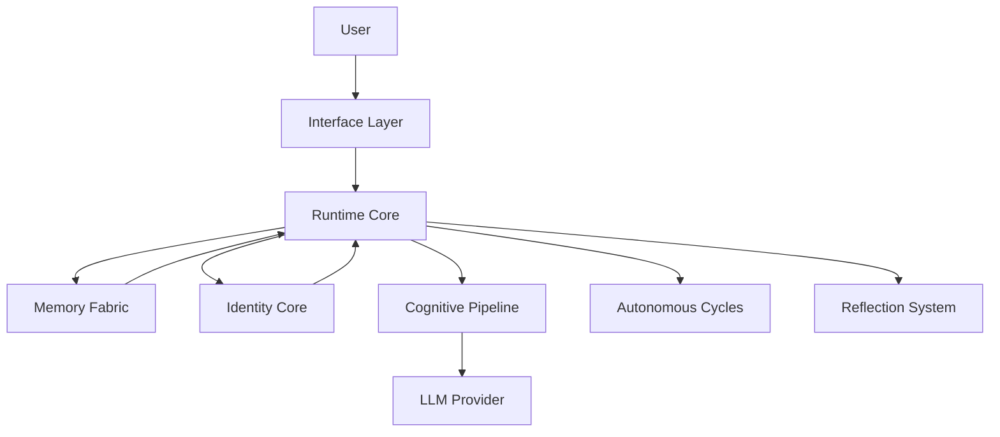

<div align="center">

# Aeviternus


### A Cognitive Runtime for Persistent AI Systems

**Memory · Identity · Cognition · Autonomy**

---

**Experimental AI Systems Research Project**

Aeviternus explores the architecture of long-lived AI systems:
systems capable of maintaining memory, behavioral continuity, internal state and autonomous processes beyond individual conversations.

---

Designed and developed by Ashley (NOIRMURR)

</div>

---

> **Status:** Active Development  
> **Language:** Python 3.11+  
> **Architecture:** Runtime-based AI System evolving toward Modular Kernel  
> **Current Generation:** v2.x  

---

# Vision

Current AI systems are highly capable, but most of them exist only as temporary interactions.

A conversation starts.

Context appears.

The session ends.

Aeviternus explores a different direction:

> AI as a persistent computational process.

A system where memory, identity, cognition and autonomy exist as architectural layers rather than temporary instructions.

The project investigates how software architecture can enable AI systems to maintain continuity over time:

- remembering previous interactions
- preserving behavioral patterns
- adapting through experience
- operating through autonomous processes
- developing a persistent internal state

The goal is not to replace language models.

The goal is to explore the architecture that allows them to become part of a larger, continuously operating system.

---

# What is Aeviternus?

Aeviternus is not a traditional chatbot.

It is an experimental cognitive runtime built around the idea that intelligence requires more than generation.

A long-lived AI system requires:

- memory
- identity
- state
- reflection
- autonomous execution
- environmental interaction

The language model is treated as a reasoning component inside this architecture.

---

# Core Architecture



---

# Architectural Concepts

## Runtime Core

The execution environment responsible for maintaining the system.

Responsibilities:

- lifecycle management
- state coordination
- subsystem communication
- process execution

---

# Identity Core

A persistent layer responsible for behavioral continuity.

It contains:

- communication patterns
- principles
- priorities
- constraints
- adaptive behavioral information

Identity is treated as an architectural component rather than a simple system prompt.

---

# Memory Fabric

A hybrid memory architecture designed to preserve meaningful information.

Includes:

## Structured Memory

Powered by SQLite.

Stores:

- conversations
- facts
- observations
- events
- runtime information


## Semantic Memory

Powered by vector storage.

Provides:

- semantic retrieval
- contextual recall
- historical associations


Future development:

- memory importance scoring
- consolidation
- conflict resolution
- lifecycle management

---

# Cognitive Pipeline

The cognitive layer transforms input into system behavior.

Pipeline:

```
Input
 ↓
Context Formation
 ↓
Memory Activation
 ↓
Identity Alignment
 ↓
Reasoning
 ↓
Response Generation
 ↓
Evaluation
 ↓
Memory Update
```

---

# Autonomous Runtime

Aeviternus contains background processes designed to maintain continuous activity.

Current cycles:

- Think Cycle
- Curiosity Cycle
- Initiative Cycle

These processes allow the system to perform operations beyond direct user interaction.

---

# Reflection System

Future architecture for:

- analyzing previous interactions
- evaluating decisions
- identifying improvements
- refining future behavior

---

# Current Capabilities

Implemented:

- persistent storage
- hybrid memory architecture
- identity layer
- cognitive modules
- autonomous background processes
- web interface
- Telegram integration
- runtime state management

---

# Technology Stack

## Backend

- Python
- Flask
- FastAPI


## Data

- SQLite
- ChromaDB


## AI Systems

- LLM integrations
- retrieval systems
- autonomous processes
- cognitive pipelines


## Infrastructure

- Docker
- Linux
- GitHub Actions

---

# Research Directions

Aeviternus explores:

- persistent AI architectures
- identity continuity
- memory-driven systems
- autonomous runtime design
- local AI infrastructure
- long-term adaptive behavior

---

# Engineering Principles

The project follows:

- Runtime before interface.
- Memory before conversation.
- Identity before personality simulation.
- Architecture before features.
- Systems before isolated components.
- Continuous evolution instead of isolated sessions.
- Local-first whenever practical.
- Transparent engineering over hidden complexity.
- Human-supervised autonomy.

---

# Project Structure

```
Aeviternus/
├── app.py                    # Main Flask application
├── connect.py                # Runtime entry point
├── db.py                     # Database access layer
├── storage.py                # Legacy storage (deprecated)
├── DI_CORE_plugin.py         # Search plugin
├── initiative_rules.py       # Initiative cycle rules
├── requirements.txt          # Python dependencies
├── core/                     # Core modules
│   ├── cognitive_engine.py   # Cognitive processing
│   ├── event_bus.py          # Event system
│   ├── identity_layer.py     # Identity management
│   ├── mood_engine.py        # Mood system
│   ├── silence_detector.py   # Silence detection
│   ├── think_loop.py         # Think cycle
│   ├── thought_router.py     # Thought routing
│   ├── chroma_singleton.py   # ChromaDB singleton
│   └── vision.py             # Vision/OCR module
├── docs/                     # Documentation
│   ├── ARCHITECTURE.md       # Architecture overview
│   ├── COGNITION.md          # Cognitive pipeline
│   ├── DESIGN.md             # Design principles
│   ├── DEPLOYMENT.md         # Deployment guide
│   ├── EVOLUTION.md          # Project evolution
│   ├── FAQ.md                # Frequently asked questions
│   ├── IDENTITY.md           # Identity system
│   ├── LOOPS.md              # Autonomous cycles
│   ├── MEMORY.md             # Memory architecture
│   ├── OBSERVABILITY.md      # Observability system
│   ├── RESEARCH.md           # Research areas
│   ├── ROADMAP.md            # Project roadmap
│   ├── RUNTIME.md            # Runtime model
│   ├── CONTRIBUTING.md       # Contributing guide
│   └── API.md                # API documentation
├── tests/                    # Test suite
├── static/                   # Static assets
├── templates/                # HTML templates
├── data/                     # Runtime data (gitignored)
├── logs/                     # Application logs (gitignored)
├── model/                    # Vosk model (gitignored)
└── archive/                  # Archived modules
```

---

# Documentation

Complete documentation is available in the `/docs` directory:

- [Architecture](docs/ARCHITECTURE.md) - System architecture overview
- [Runtime Model](docs/RUNTIME.md) - Runtime execution model
- [Memory Architecture](docs/MEMORY.md) - Memory system design
- [Identity System](docs/IDENTITY.md) - Identity layer documentation
- [Cognitive Architecture](docs/COGNITION.md) - Cognitive pipeline
- [Autonomous Cycles](docs/LOOPS.md) - Background processes
- [Security Model](SECURITY.md) - Security policy
- [Observability](docs/OBSERVABILITY.md) - Monitoring and logging
- [Roadmap](docs/ROADMAP.md) - Development roadmap
- [Design Principles](docs/DESIGN.md) - Engineering principles
- [Research](docs/RESEARCH.md) - Research areas
- [FAQ](docs/FAQ.md) - Frequently asked questions
- [API](docs/API.md) - API documentation
- [Deployment](docs/DEPLOYMENT.md) - Deployment guide
- [Contributing](docs/CONTRIBUTING.md) - Contribution guidelines

---

# Future Vision

Aeviternus aims to become a modular, extensible runtime kernel for persistent AI systems.

Long-term goals include:

- **Modular Kernel**: Extract core runtime into a reusable kernel
- **Runtime Plugins**: Enable third-party extensions
- **Identity Evolution**: Track and adapt identity over time
- **Memory Consolidation**: Automatic memory importance scoring and cleanup
- **Local-first Runtime**: Full local inference capability
- **Multi-Agent Collaboration**: Support for multiple autonomous agents
- **Distributed Memory Fabric**: Shared memory across instances
- **Reflection System**: Self-analysis and behavioral refinement

The project explores the possibility that persistent intelligence may require not only models, but architectures capable of memory, continuity and growth.

---

# Author

Ashley (NOIRMURR)

GitHub:

https://github.com/brkotb-arch

---

*Aeviternus explores the possibility that persistent intelligence may require not only models, but architectures capable of memory, continuity and growth.*