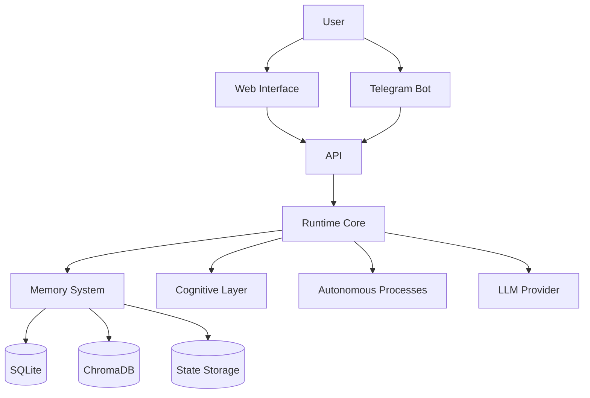

# Aeviternus Architecture

## Overview

Aeviternus is a persistent AI runtime designed around long-term memory, autonomous processes, and adaptive identity.

The system is built as a continuously running environment where the language model acts as a reasoning engine connected to external memory, state management, and autonomous execution loops.

---

# High-Level Architecture

# Core Layers

## 1. Interface Layer

Responsible for communication channels.

Current interfaces:

- Web application
- Telegram integration
- Voice interface

Responsibilities:

- Receive input
- Validate requests
- Display responses
- Handle sessions

---

# 2. Runtime Core

The runtime coordinates all internal components.

Responsibilities:

- Request routing
- State management
- Memory access
- Background processes
- Error handling

---

# 3. Memory Layer

Aeviternus uses hybrid memory architecture.

## SQLite

Stores structured information:

- conversations
- facts
- observations
- moods
- events
- system state

## ChromaDB

Stores semantic information:

- previous conversations
- concepts
- discoveries
- contextual memories

---

# 4. Cognitive Layer

Responsible for response generation logic.

Components:

- identity processing
- mood adaptation
- context preparation
- self-analysis

---

# 5. Autonomous Layer

Background processes running independently:

- think_loop
- curiosity_loop
- initiative_loop

These processes allow the system to operate beyond direct user requests.

---

# Design Principles

## Persistent State

The system should preserve important information between sessions.

## Local First

External APIs are optional. The architecture supports local models.

## Modular Evolution

Components should evolve independently.

## Transparency

Internal processes should be observable and documented.

---

# Future Architecture

Planned improvements:

- Arbitration Kernel
- LLM Queue
- Memory Router
- Local Ollama Runtime
- Advanced context compression
- Improved observability
