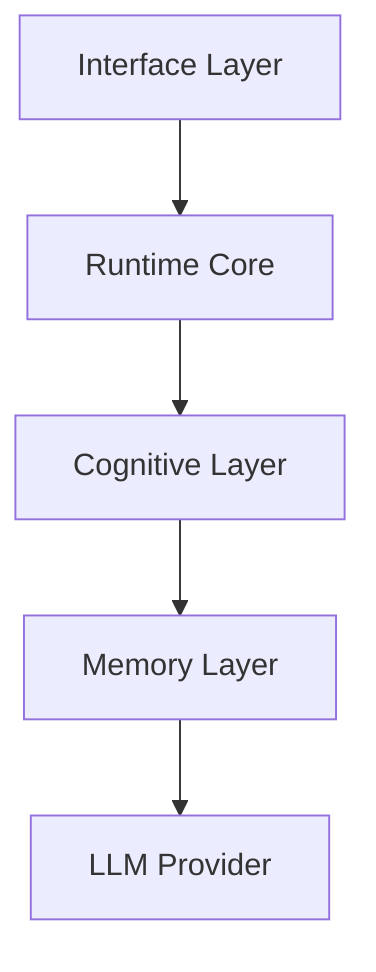

# Aeviternus Design Principles

## Overview

Aeviternus is designed as a persistent AI runtime rather than a traditional chatbot.

The architecture is built around several core principles that define how the system stores information, evolves, and interacts with AI models.

---

# 1. Persistence

The system maintains meaningful state across sessions.

Memory, configuration, and identity are externalized from the language model and managed by dedicated system components.

This allows the runtime to preserve continuity over time.

---

# 2. Separation of Concerns

Each subsystem has a clearly defined responsibility.

The architecture separates user interaction, execution logic, reasoning processes, memory management, and model inference.

# 3. Local Independence

External models are replaceable components.

The architecture supports multiple execution modes:

- cloud-based APIs
- local models
- hybrid operation

The runtime should remain independent from any specific model provider.

# 4. Evolutionary Architecture

The system is designed for gradual and controlled improvement.

New capabilities should be introduced as independent modules without requiring destructive changes to existing components.

Each subsystem should be replaceable, extendable, and independently developed.

# 5. Observability

Internal behavior should be measurable, traceable, and explainable.

Logs, metrics, diagnostics, and system state monitoring are considered first-class components of the architecture.

Observability enables debugging, evaluation, and continuous improvement.
