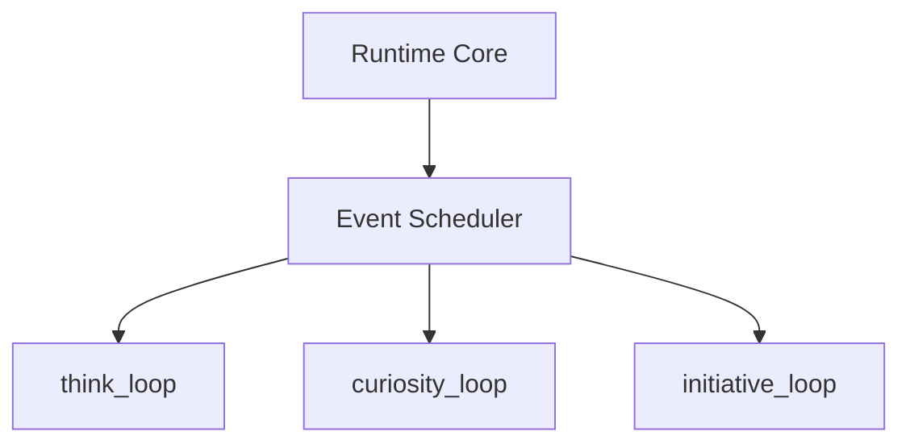

# Aeviternus Autonomous Loops

## Overview

Aeviternus contains background processes that allow the runtime to perform operations beyond direct user interaction.

These autonomous loops create continuous system activity and enable the runtime to maintain internal processes over time.

---

# Current Loops

## `think_loop`

Purpose:

Internal processing and system maintenance.

Responsibilities:

- analyze recent events
- update internal state
- perform self-checks
- maintain runtime consistency

---

## `curiosity_loop`

Purpose:

Information discovery and knowledge expansion.

Responsibilities:

- search external sources
- collect relevant information
- identify interesting discoveries
- enrich system knowledge

Future:

- autonomous research
- knowledge expansion
- information prioritization

---

## `initiative_loop`

Purpose:

Controlled proactive interaction.

Responsibilities:

- generate suggestions
- notify about important events
- provide system updates
- initiate relevant interactions

---

# Loop Architecture

---

# Current Limitations

## Shared LLM Resource

Multiple autonomous loops may compete for access to the language model.

Solution:

- Arbitration Queue
- centralized LLM scheduling

---

## Missing Priority System

Not every action has equal importance.

Future improvements:

- priority-based execution
- task ranking
- resource-aware scheduling

---

## Resource Management

Future improvements:

- CPU limits
- memory limits
- execution timeouts
- failure recovery
- process monitoring
