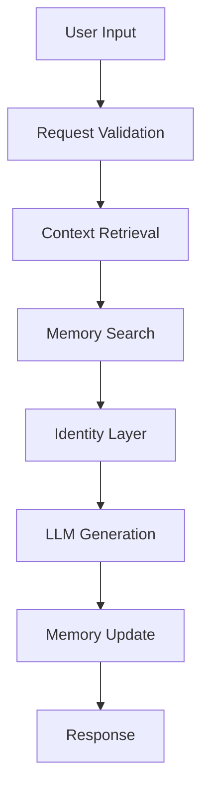

# Aeviternus Runtime

## Purpose

The Runtime is the execution environment responsible for keeping Aeviternus continuously active.

Unlike a traditional chatbot that exists only during user interaction, Aeviternus is designed as a persistent process with internal state, background activity, and autonomous execution.

---

# Runtime Responsibilities

The runtime manages:

- incoming requests
- background loops
- memory operations
- system state
- model communication
- component coordination

---

# Execution Flow

---

# Current Runtime Components

## `connect.py`

Main runtime entry point.

Responsibilities:

- startup sequence
- process initialization
- service supervision
- runtime configuration loading

---

## `app.py`

Main web server component.

Responsibilities:

- HTTP routes
- user communication
- API handling
- request processing

---

## Background Services

Autonomous processes running independently from direct user interaction:

- `think_loop`
- `curiosity_loop`
- `initiative_loop`

---

# Future Runtime Kernel

Planned improvements:

- centralized task scheduler
- LLM request queue
- priority management system
- resource management
- failure recovery
- runtime monitoring
